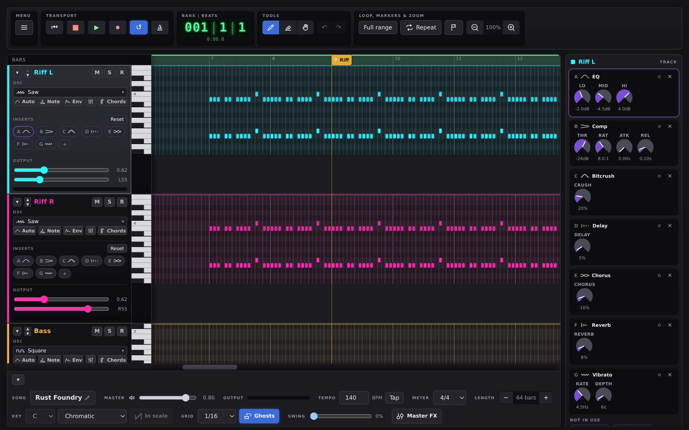
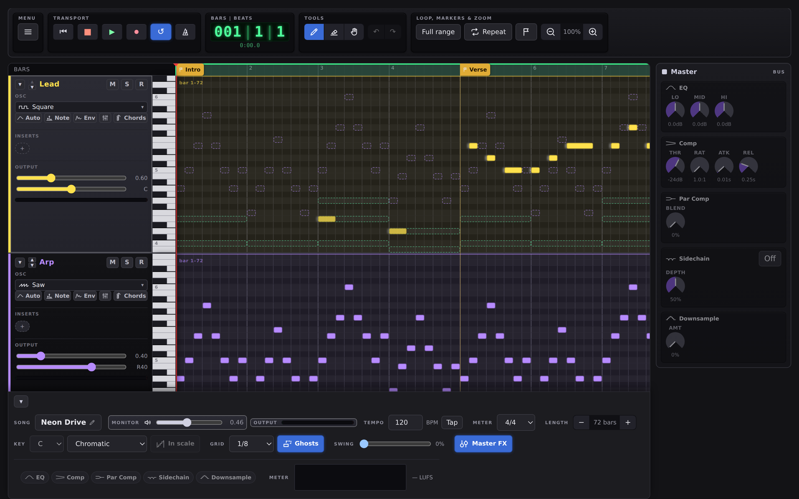
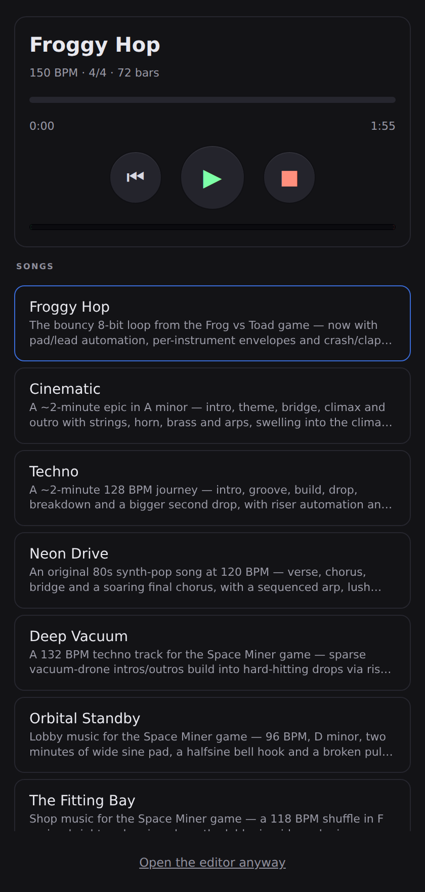

# 🎵 Web Audio Studio

Try it: https://ruperto72.github.io/music-studio/

A browser-based **8-bit chiptune editor**. Compose looping tracks the way you
would in a small studio (Pro Tools–style stacked lanes) — everything is
synthesised live with the Web Audio API, so there are **no audio files and no
dependencies**. It's a single self-contained `index.html` plus a small song-data
module.

It was extracted from the [Frog vs Toad](https://github.com/Ruperto72/frogger-multiplayer)
game, whose soundtrack ships here as the **Froggy Hop** example song.



<sub>The editor, with `Rust Foundry` loaded. Each track's inserts are lettered
chips in its header; the knobs live in the inspector column on the right.</sub>

## Features

### Composing

- Stacked **tracks** with a shared timeline and playhead
- **Add / rename / remove / reorder** tonal tracks, plus one or more **rhythm**
  tracks sharing a fixed 10-piece palette (kick, snare, rim, hi-hat, open hat,
  shaker, tom, clap, crash, ride)
- **Duplicate a track** (⧉ in its header) — the part *and* the whole voice,
  copied below it. "Try this line on another instrument" is a two-second move
  rather than a selection, a new track and a paste
- **Three drum kits** — each rhythm track picks whether those ten pieces are
  synthesised as **Retro** (tight and dry, the 8-bit default), **80s** (gated
  snare, long crash, wide clap) or **Acoustic-ish** (lower kick, more skin on
  the snare), from the same picker a tonal track uses for its waveform, each
  kit drawing the shape of its own decay. Same rows, same patterns, same hits:
  switching re-voices the part without touching a note of it, and the choice
  saves with the song
- A **playable piano keyboard** down the left of every tonal track instead of a
  column of note names — press a key to hear it through that track's own
  instrument, drag down the keys to glissando. Rhythm tracks keep their ten
  piece names
- A **note lane** per track (the **Vel** button): one stem per note or hit with
  a diamond head to drag, showing **velocity**, **pan** or **bend** — pick which
  from its header. The grid dims a quiet item, but *which of these is loudest*
  is a comparison, and heights compare better than shades of one colour
- **Free** placement in the Grid menu (Pro Tools' Slip): place, drag and resize
  without snapping. The grid still sets how long a new note is
- **Transpose** (menu → Transpose) by semitones, octaves or — with a key set —
  by **scale steps**, which move each note to the next pitch *in the key*, so a
  melody nudged upward stays in the key instead of landing on the note between.
  **Fit to the scale** pulls a take onto the nearest scale tones, and never
  merges two notes into one. With Keep to scale on, **↑/↓** move by a scale
  step and **Alt+↑/↓** stay chromatic
- **Quantize and humanize** (menu → Timing), with a **strength**: 100% lands
  every note on the grid, 50% halves the error and keeps the feel. Recording
  no longer snaps as you play — a take keeps your timing, and correcting it is
  a separate decision
- **Pen / Eraser / Grab** tools; drag to move, drag the right edge to resize,
  drag empty space to marquee-select
- **Key and scale** — pick a tonic and a scale in the bottom bar and the lane
  shades every row outside it, dims those keys on the keyboard, and marks the
  tonic. Nothing is forbidden; you can just *see* where the wrong notes are
  before you hear them. Turn on **Keep to scale** and a note placed or dragged
  with the mouse moves to the nearest pitch in the scale — playing is never
  corrected, the same way recording never quantises as you play
- **Chord progressions** — a built-in progression (I–V–vi–IV, ii–V–I, the
  Andalusian cadence, a 12-bar blues, …) written straight into a track, one
  chord per bar, in the song's key. They're stored as *degrees*, not chords,
  so the same progression comes out major or minor depending on the scale you
  picked: change the key and insert it again to hear it somewhere else
  entirely. The drum side has had this for a while — this is the same idea for
  the half of a song that isn't the beat
- **Chords** — place several pitches in one column, or build one from a
  selected note with the inspector's ten quick voicings (power chord, maj,
  min, dim, aug, sus2, sus4, 7, maj7, m7), which add real notes above the
  root rather than flagging the one you picked
- Selectable **grid** resolution (1/4, 1/8, 1/16 and triplets) and a **swing**
  control for a shuffled 8th feel
- **Time signature** (4/4, 3/4, 6/8, …) and named **timeline markers**
- **Loop** range, zoom, multi-select, copy/paste, undo/redo
- **Recording from the computer keyboard** — arm a track with its **R**
  button, hit Record for a bar of count-in, and play: a tracker-style key
  layout (ZSXDCV… plus the row above for sharps, QWERTY an octave up, `[`/`]`
  to shift octave) on tonal tracks, the ten kit pieces on rhythm tracks.
  Everything lands on the grid at the current snap resolution. A **metronome**
  clicks on every beat, accented on the downbeat, and never reaches an
  exported WAV
- **Overdub** — turn **Loop** on before you record and the transport keeps
  going round: the count-in happens once, and each lap adds to what's already
  there instead of replacing it, which is how a drum part actually gets built.
  Playing the same pitch in the same place replaces just that note
- **MIDI keyboard** — **Connect MIDI keyboard** in the menu and play a real
  keyboard into the armed track, **with how hard you hit the keys**: velocity
  reaches the note you hear while playing and the note that lands on the grid,
  drawn there as brightness. Works for monitoring, recording and step entry
  alike; drums map through General MIDI. Listens to every input on every
  channel, so there is nothing to pick
- **Step entry** — with a track armed and the transport *stopped*, the same
  keys write a note at the playhead and move it on one step, so you can type
  a part out at your own pace. Keys held together land as a chord on one
  column; `←`/`→` move through time, `↑`/`↓` between tracks, `Home`/`End` to
  the ends, `Backspace` steps back and clears. Every move is announced with
  the position *and* what's already there, so this is also how you compose —
  and read a song back — without a mouse at all
- Built-in **rhythm patterns** (Rock, Techno, Disco, Swing, Hip-Hop, House,
  Breakbeat, Funk, Half-time, Bossa Nova, Reggae, Trap) you can audition and
  stamp into a rhythm track. Every hit lands with its own velocity, so the
  groove has accents rather than a flat machine pulse, and each pattern
  carries a **fill** bar used on the last bar of every phrase (2, 4 or 8
  bars, or off), with a crash on the downbeat after it. The kit is spread
  across the stereo field on insert — hi-hat and ride right, shaker, toms
  and crash left, kick and snare centred — which you can switch off

### Sound design

- Per-track **waveform** — square, **PWM** (a pulse width that sweeps
  continuously across the part, so every note picks the sweep up where the
  last one left off), triangle, saw, sine, **half sine**, an **NES triangle**
  wavetable, pitched **noise** (a chip's noise channel, so it buzzes at the
  note rather than just hissing), **ring modulation**, and **FM** (with
  modulator ratio/depth)
- Per-track **ADSR envelope**, a resonant **lowpass filter** with its own
  envelope amount, and a **duty cycle** (pulse width) for square-wave tracks
  that any single note can override
- **Instrument presets** — eight built-in starting points (electric piano,
  bell, marimba, plucked string, brass, warm pad, round bass, chip lead) that
  are pure settings for the synth already there: the electric piano is an FM
  patch, the plucked string is a filter envelope. Load one, tune it, and save
  the result as your own preset for any tonal track in any song. An acoustic
  piano is *not* among them — that needs samples, which is a separate
  question (`TODO.md`)
- Per-track **FX**: continuous Delay / Chorus / Reverb sends, a 3-band
  **EQ**, a **compressor**, a **bitcrush** downsampler, a **tremolo**, and a
  **vibrato** on tonal tracks — all neutral by default. The track header
  shows them as compact **chips** (which effect, in what order, what's
  bypassed); the knobs live in the inspector column, which shows the active
  track's whole chain whenever no note is selected
- Per-note effects: velocity, **pan**, bend, vibrato, tremolo, pulse width
  (duty), arpeggio, portamento, bitcrush, echo, chorus and reverb — pan places
  a single note in the stereo field on top of its track's own pan
- **Per-hit velocity and pan** on rhythm tracks — click a drum hit to set how
  hard it's struck, so a pattern can have accents instead of sounding
  mechanical, and where it sits in the stereo field, so the kit spreads out
  instead of stacking in one spot; quieter notes and hits are drawn dimmer.
  Velocity shapes the **tone** as well as the level — a soft hit is darker,
  like a real drum struck gently, so a ghost note sits behind the beat rather
  than being a quiet copy of the accent
- **Automation curves** per track — draw Volume, Pan, or Delay/Chorus/Reverb
  send over time
- **Master bus**: 3-band EQ, compressor with a parallel ("New York") blend,
  kick/snare **sidechain** ducking, a lo-fi downsampler, and a live spectrum
  plus approximate LUFS meter. It behaves like any other channel — click the
  **Master** cell in the bottom bar (or one of its chips) and the whole
  master chain opens in the same inspector column a track's effects use



<sub>The master bus takes the same strip a track does, so its five groups are
visible at once. A chip is dimmed while its effect is doing nothing.</sub>

### Saving & exporting

- **Song library** — bundled examples or your own songs saved in this browser
- **Save file / Load file** download/upload a song as `.json`
- **Export / Import MIDI** move a Standard MIDI File (format 1)
- **Export WAV** renders the whole song offline and downloads a `.wav`
- **Export code** writes the song as `TRACKS` / `RHYTHM_TRACKS` JS literals to drop into
  a game
- **Keyboard & screen reader**: Tab reaches every control with a visible focus
  ring, Shift+←/→ walks the notes of a track and Home/End jump to its ends,
  with each selection announced as pitch and bar/beat — and step entry (above)
  adds a cursor you can move around the grid in both directions, announcing
  what's at each step, so a song can be written and read back without a mouse
- **On a phone it's a player, not an editor** — below 760px the page becomes
  a song list with a transport, a draggable position bar and a level meter,
  since listening is what a phone is actually for here. The controls stay
  pinned at the top and only the list scrolls, so you don't lose Play while
  thumbing for the next song. "Open the editor anyway" is there if you
  disagree, and is remembered


- **Installable PWA** — works offline once loaded, and can be added to the
  home screen as a standalone/fullscreen app; a **Fullscreen** menu item also
  toggles plain browser fullscreen

## Roadmap

Most of the original audio-engine roadmap is now built — wavetable
synthesis, FM, a per-track resonant filter, aux sends for reverb/delay,
custom DSP via `AudioWorklet`, spectrum + LUFS metering, parallel compression,
sidechain ducking and voice pooling all ship today.

Still open (see `TODO.md` for the full breakdown):

- **Sampling** — sample playback and granular synthesis
- **Collaboration** — cloud sync and live multi-user editing
- **Accessibility** — the grid is labelled, keyboard-navigable in both
  directions and notes can be *created* from the keyboard (step entry); what
  the remaining gaps are is now a question for someone who uses a screen
  reader daily rather than something to guess at

## Run it locally

No build step, nothing to install. Serve the folder over http:// (ES modules
don't work from `file://`):

```bash
node dev.js               # starts the server and opens a browser
node dev-server.js        # server only — then open http://localhost:8080
```

On Windows you can double-click `start.cmd` instead of opening a terminal.
Any static server works too, e.g. `python3 -m http.server 8080`.

There's no build or lint step and no test framework. The closest thing to a
test command is:

```bash
node verify.js            # headless-browser smoke test
node verify.js --only kit # just the steps whose name contains "kit"
```

The screenshots above are generated the same way, so they can be refreshed
rather than re-staged by hand when the interface moves:

```bash
node shots.js             # rewrites docs/img/*.png
```

It starts its own server, drives the app through a set of core interactions in
a real headless Chromium over the Chrome DevTools Protocol, and fails if any
expectation is wrong *or* if the page logs a console error at any point. It
needs a Chromium-family browser on the machine (`CHROME_PATH=…` to point at a
specific one).

The app icon is drawn by a command too, from one path in one file:

```bash
node icons.js             # rewrites icons/*.png and icons/*.svg
```

## Songs: examples vs. your own

- **Examples** live in `songs/` and are listed in `songs/index.json`. They load
  over the network (from this site) via the **Songs** menu.
- **Your songs** are saved in the browser's `localStorage` — nothing is
  uploaded. Use **Songs → Save current** to store the current song under a
  name, and Load/Delete them from the same menu.
- **Save file / Load file** in the menu download/upload a song as a `.json` file.

The page always starts as a fresh project with the starter tracks (Lead,
Harmony, Bass, Pad and Rhythm, all empty); pick a song explicitly from the
**Songs** menu. Work is autosaved to this browser in the background purely
as crash recovery — it's never restored automatically.

### Add an example song

1. In the editor, build a song and click **Save file** to download its `.json`.
2. Drop the file into `songs/` (e.g. `songs/my-tune.json`).
3. Add an entry to `songs/index.json`:
   ```json
   { "file": "my-tune.json", "name": "My Tune", "desc": "One-line description." }
   ```
4. Bump `CACHE_NAME` in `sw.js` so installed clients pick up the change.

The bundled examples are `froggy-hop.json` (the game demo), `cinematic.json`,
`techno.json`, `neon-drive.json`, `space-miner.json`, `neon-cathedral.json`,
`rust-foundry.json`, and the two Space Miner game loops
`space-miner-lobby.json` and `space-miner-shop.json`.

## Deploy to GitHub Pages

The site is fully static, so it needs no build and no workflow. Once this
folder is the root of its own repo:

1. **Settings → Pages → Build and deployment → Source: _Deploy from a branch_,
   `main` / `/ (root)`.**
2. Push to `main`.

Pages serves the whole folder, so the examples load from the same origin.
(`.nojekyll` is included so the files are served as-is.)

## Installing on Android

This is a [Progressive Web App](https://web.dev/progressive-web-apps/): open
the site in Chrome on Android, then use the browser menu's **Add to Home
screen** / **Install app** option (Chrome may also prompt automatically). The
installed app opens without browser chrome and keeps working offline once
it's been loaded once, since `sw.js` precaches the app shell and the bundled
example songs. `manifest.webmanifest` requests fullscreen display where the
browser supports it (falling back to a standalone app window otherwise); the
in-app **Fullscreen** menu item toggles fullscreen for regular browser tabs too.

## Layout

```
index.html                  the editor (self-contained: HTML + CSS + JS + synthesis)
js/song-data.js             the demo song's note data (TRACKS, RHYTHM_TRACKS, TEMPO_BPM)
js/downsample-processor.js  AudioWorklet behind the master and per-track bitcrush
songs/                      example songs + index.json
manifest.webmanifest        PWA manifest (name, icons, display mode)
sw.js                       service worker: offline cache for the app shell
icons/                      generated app icons (see icons.js)
dev-server.js               tiny static server for local use
dev.js                      starts dev-server.js and opens a browser
start.cmd                   Windows double-click entry point
verify.js                   headless-browser smoke test
shots.js                    regenerates the screenshots in docs/img/
icons.js                    regenerates the app icon in icons/
cdp.js                      shared browser-driving plumbing for the three above
docs/img/                   the screenshots this README links to
TODO.md / DONE.md           what's left, and the journal behind what's built
docs/                       design notes and implementation plans
```

For a deeper tour, `DESIGN.md` specifies the GUI and the internal architecture,
`CLAUDE.md` is a shorter orientation for editing the code, `TODO.md` tracks what
isn't built yet, and `DONE.md` is the working journal behind what is — the
measurements, the hypotheses that were ruled out and why each solution looks the
way it does.
